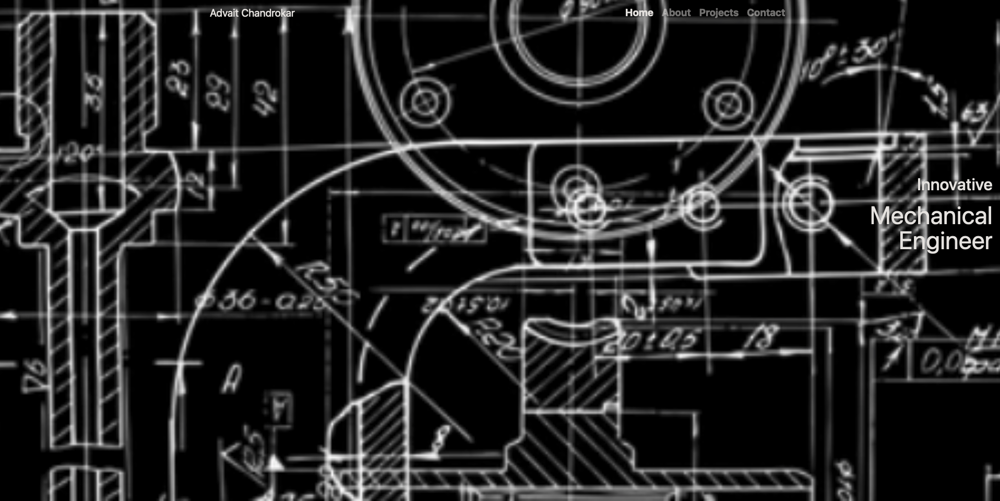

# Advait's Portfolio Website

## Overview

This repository contains the source code for Advait Chandorkar's personal portfolio website. The website showcases Advait's skills, projects, and provides a way to contact him. It is built using HTML, CSS, and JavaScript.

## Table of Contents

- [Overview](#overview)
- [Features](#features)
- [Contact](#contact)
- [Setup and Usage](#setup-and-usage)
- [License](#license)

## Features

- **Responsive Design:** The website is designed to be fully responsive, ensuring a seamless experience on various devices.
- **Project Showcase:** Display a collection of notable projects, each with a link to the GitHub repository.
- **Contact Form:** A contact form is provided to facilitate communication. Users can reach out with inquiries or project proposals.
- **Interactive Elements:** Incorporate interactive elements to make the website engaging and user-friendly.

## Contact

Feel free to reach out to Advait for collaboration, questions, or discussions.

- **Email:** advait@email.com
- **LinkedIn:** [Advait's LinkedIn Profile](https://www.linkedin.com/in/advaitchandorkar/)
- **Twitter:** [@AdvaitTwitter](https://twitter.com/advaittwitter)

## Setup and Usage

To run the website locally, follow these steps:

1. Clone the repository: `git clone https://github.com/AdvaitChandorkar07/Advait.github.io.git`
2. Open `index.html` in a web browser.

## License

This project is licensed under the [MIT License](LICENSE).
